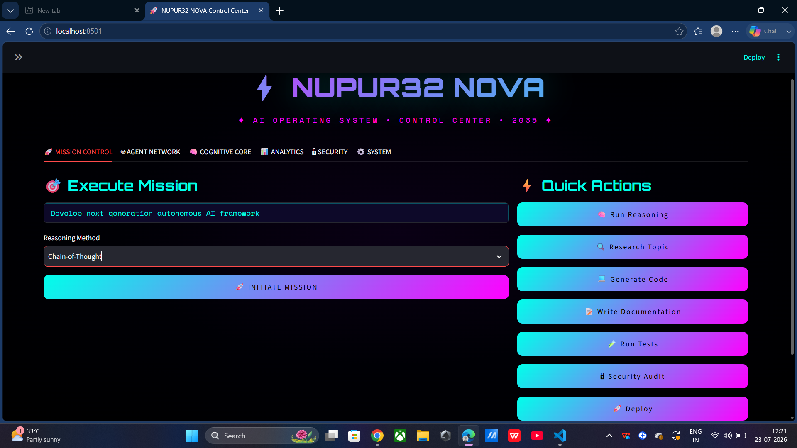
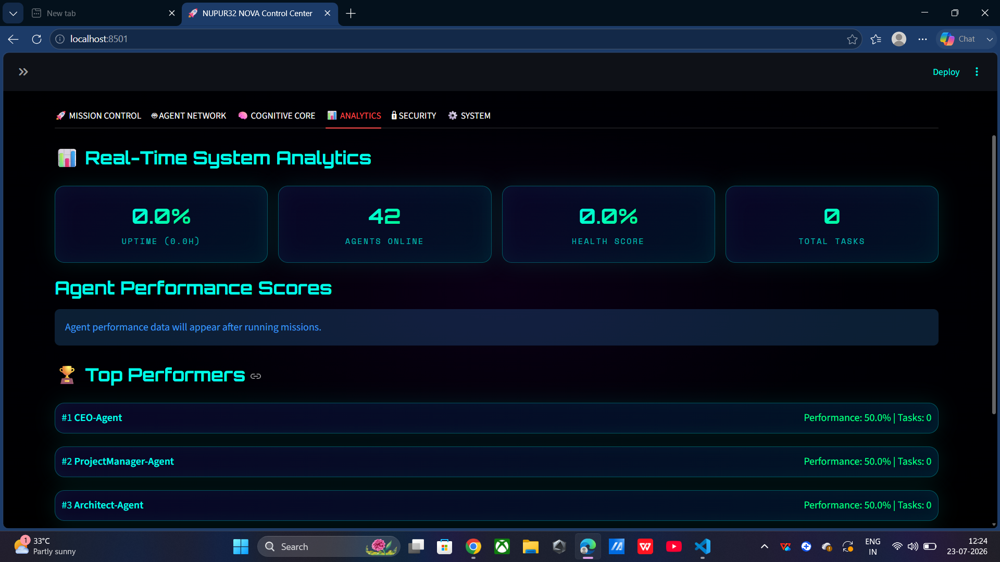
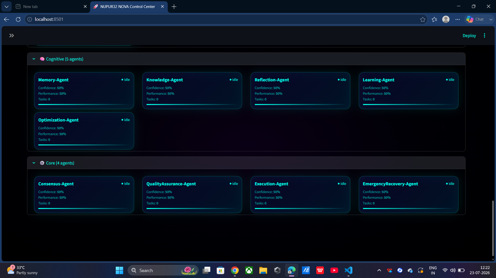
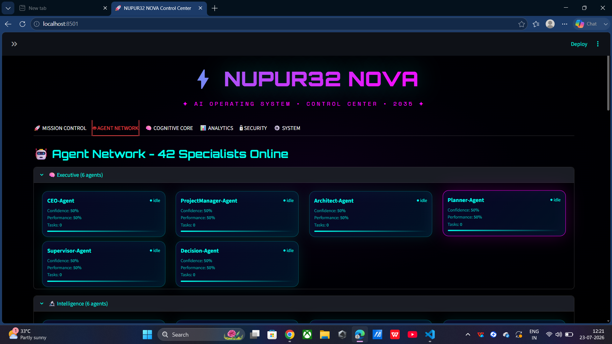
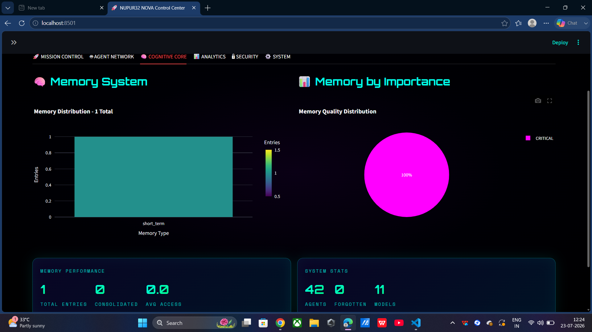
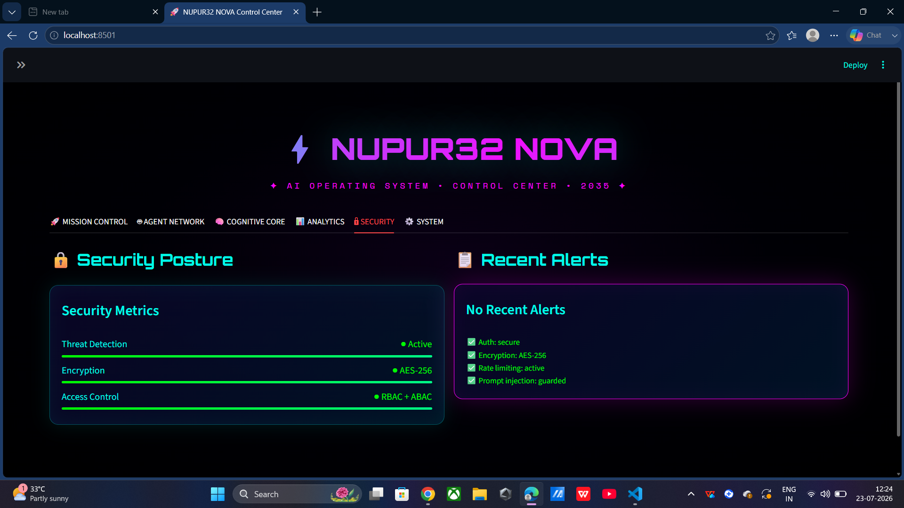
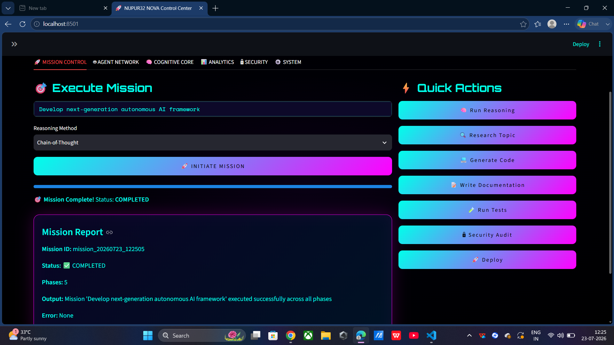

<div align="center">

# ⚡ NUPUR32® Multi-Agent AI System


<p align="center">


</p>

---

## 🌌 Beyond Artificial Intelligence

### **Welcome to the Era of Autonomous Collective Intelligence**

Traditional AI models generate responses.

**NUPUR32® Multi-Agent AI System** orchestrates an intelligent ecosystem where autonomous AI agents **plan**, **reason**, **research**, **code**, **analyze**, **secure**, **learn**, and **collaborate** in real time to accomplish complex objectives with minimal human intervention.

It is not simply an AI assistant.

It is a **digital AI workforce** engineered to function as an autonomous organization.

---

## ⚡ Core Philosophy

> 🧠 **One AI answers questions.**  
> 🚀 **A Multi-Agent AI System understands problems.**  
> 🤖 **Specialized AI agents collaborate.**  
> 🌍 **Collective Intelligence creates complete solutions.**

---

# 🌐 Welcome to the Future of Intelligent Automation

### **Think Beyond Chatbots.**

### **Think Beyond Copilots.**

# ⚡ Think Autonomous Intelligence.

</div>

# 🌍 Overview

**AI Multi-Agent System** is a next-generation autonomous artificial intelligence platform where specialized AI agents collaborate, reason, remember, plan, and execute complex tasks as a coordinated digital workforce.

Instead of relying on a single language model, the system creates an intelligent ecosystem composed of multiple expert agents working together through orchestration, shared memory, advanced reasoning, and knowledge retrieval.

The architecture is designed for scalability, extensibility, enterprise deployment, and real-world AI automation.

---

# ✨ Key Features

## 🤖 Autonomous AI Agents

A complete ecosystem of specialized AI agents capable of collaborating autonomously.

- Executive Agent
- Project Manager
- Software Engineer
- Code Reviewer
- Debugger
- DevOps Engineer
- Security Analyst
- Cloud Architect
- Research Agent
- Machine Learning Engineer
- Data Scientist
- Knowledge Engineer
- Documentation Agent
- Vision Agent
- Browser Agent
- Reflection Agent
- Optimization Agent
- Emergency Recovery Agent

and many more...

---

# 🧠 Advanced Memory System

The platform includes a cognitive memory architecture inspired by human intelligence.

### Memory Types

- Working Memory
- Short-Term Memory
- Long-Term Memory
- Semantic Memory
- Episodic Memory
- Procedural Memory
- Conversation Memory
- Knowledge Memory
- Project Memory
- User Memory
- Emotional Memory
- Spatial Memory
- Skill Memory
- Encrypted Memory

---

# 💡 Intelligent Reasoning Engine

Supports multiple reasoning strategies that allow agents to think before acting.

- Chain of Thought
- Tree of Thoughts
- Graph of Thoughts
- Reflection
- Debate
- Recursive Reasoning
- Self Critique
- Goal Decomposition
- Monte Carlo Planning
- Hypothesis Generation

---

# 📚 Knowledge Ecosystem

The system combines multiple knowledge sources.

- Retrieval Augmented Generation (RAG)
- Vector Databases
- Knowledge Graphs
- Semantic Search
- Internet Search
- Local Document Intelligence

---

# ⚙️ Core Architecture

```
                    ┌────────────────────────────┐
                    │   User / API / Dashboard   │
                    └──────────────┬─────────────┘
                                   │
                     AI Orchestrator & Scheduler
                                   │
      ┌───────────────┬────────────┼───────────────┬─────────────┐
      │               │            │               │             │
  AI Agents      Memory Engine   Knowledge     Reasoning     Security
                                   Hub          Engine        Layer
      │               │            │               │             │
      └───────────────┴────────────┼───────────────┴─────────────┘
                                   │
                           Event Bus & Plugins
                                   │
                     APIs • Docker • Kubernetes
```

---

# 🚀 Major Capabilities

### Multi-Agent Collaboration

Agents communicate with one another.

Delegate work.

Share knowledge.

Vote on decisions.

Reach consensus.

Execute tasks.

---

### Autonomous Planning

The system automatically

- Breaks goals into subtasks
- Assigns expert agents
- Tracks progress
- Optimizes execution

---

### Continuous Learning

Every completed task improves the system.

Agents learn from:

- Previous conversations
- Successful executions
- Failures
- Reflections

---

### Enterprise APIs

- REST APIs
- FastAPI
- Async Execution
- WebSocket Streaming
- Plugin System

---

### Security

- Zero Trust Architecture
- JWT Authentication
- Encryption
- Audit Logs
- Secret Management
- Threat Detection

---

# 📂 Project Structure

```
multi-agent-ai-system/

│
├── agents/
│   ├── executive/
│   ├── development/
│   ├── research/
│   ├── security/
│   ├── operations/
│   └── creative/
│
├── orchestrator/
├── memory/
├── reasoning/
├── knowledge/
├── api/
├── plugins/
├── monitoring/
├── dashboard/
├── config/
├── tests/
├── Dockerfile
├── docker-compose.yml
├── requirements.txt
└── main.py
```

---

# 🚀 Getting Started

## Clone Repository

```bash
git clone https://github.com/NUPUR32/Multi_Agent_AI_System.git

cd Multi_Agent_AI_System
```

---

## Create Virtual Environment

```bash
python -m venv venv
```

Windows

```bash
venv\Scripts\activate
```

Linux / Mac

```bash
source venv/bin/activate
```

---

## Install Dependencies

```bash
pip install -r requirements.txt
```

---

## Configure Environment

```bash
cp .env.example .env
```

Add your API keys.

```
OPENAI_API_KEY=
GOOGLE_API_KEY=
ANTHROPIC_API_KEY=
GROQ_API_KEY=
```

---

## Run the System

```bash
python main.py
```

---

# 🐳 Docker Deployment

```bash
docker-compose up -d
```

or

```bash
docker build -t multi-agent-ai .

docker run multi-agent-ai
```

---

# ☁️ Kubernetes

```bash
kubectl apply -f deployment.yaml

kubectl apply -f service.yaml
```

---

# 📈 Enterprise Features

✅ Multi-Agent Collaboration

✅ Event-Driven Architecture

✅ Plugin Framework

✅ RAG Pipeline

✅ Knowledge Graph

✅ Vector Search

✅ Memory Engine

✅ Reflection Engine

✅ Self-Improvement

✅ Monitoring

✅ Logging

✅ Docker Support

✅ Kubernetes Support

✅ REST API

✅ WebSocket

✅ Distributed Execution

---

---

# 📸 Screenshots

## 🚀 NOVA Control Center

<p align="center">
  
</p>

The main dashboard providing centralized monitoring and control of the Multi-Agent AI System.

---

## 📊 Advanced Analytics Dashboard

<p align="center">
  
</p>

Real-time analytics including agent performance, confidence scores, task execution metrics, and system monitoring.

---

## 🧠 Core AI Agents

<p align="center">
  
</p>

The foundational autonomous agents responsible for orchestration, planning, execution, and decision making.

---

## 🔬 Intelligence & Development Agents

<p align="center">
  
</p>

Specialized AI agents for research, reasoning, coding, debugging, testing, documentation, analytics, and machine learning.

---

## ⚙️ Executive Agents

<p align="center">
  
</p>

High-level management agents responsible for coordinating workflows, planning, and autonomous execution.

---

## 🧩 Operations & Cognitive Agents

<p align="center">
  
</p>

Operational intelligence combined with cognitive reasoning for adaptive decision making and workflow optimization.

---

## 🧠 Cognitive AI Layer

<p align="center">
  
</p>

AI reasoning, memory management, contextual understanding, and autonomous learning capabilities.

---

## 🔒 Security Agents

<p align="center">
  
</p>

Dedicated agents responsible for monitoring, validation, security policies, and threat detection.

---

## 🛡️ Security & Creative Agents

<p align="center">
  
</p>

Creative AI working alongside security-focused agents for intelligent content generation and protected execution.

---

## 📋 Complete System Overview

<p align="center">
  
</p>

A complete overview of the entire NUPUR32 Multi-Agent AI ecosystem with all autonomous agent categories.

---

# 🔮 Future Roadmap

### Version 2.0

- Federated Multi-Agent Network
- Agent Marketplace
- Autonomous Code Generation
- Desktop Automation
- Voice AI

### Version 3.0

- Self-Evolving AI Agents
- Multi-Computer Collaboration
- Autonomous Research Teams
- AI Operating Environment

### Version 4.0

- AI Company Simulation
- Autonomous Enterprise Management
- AGI-Inspired Cognitive Framework

---

# 🛠️ Tech Stack

- Python
- FastAPI
- LangChain
- OpenAI
- Anthropic
- Google Gemini
- Groq
- Docker
- Kubernetes
- PostgreSQL
- MongoDB
- Redis
- Neo4j
- FAISS
- ChromaDB
- OpenTelemetry
- Prometheus
- Grafana

---

# 🎯 Vision

Our mission is to redefine artificial intelligence by moving beyond single-model assistants toward autonomous, collaborative, and self-improving multi-agent ecosystems capable of solving complex real-world problems.

---

# 👨‍💻 Developer

### **Nupur**

**AI Engineer • Multi-Agent Systems • Autonomous AI • Enterprise AI • Intelligent Automation**

---

## ⭐ Star this repository if you believe the future belongs to autonomous AI agents.
